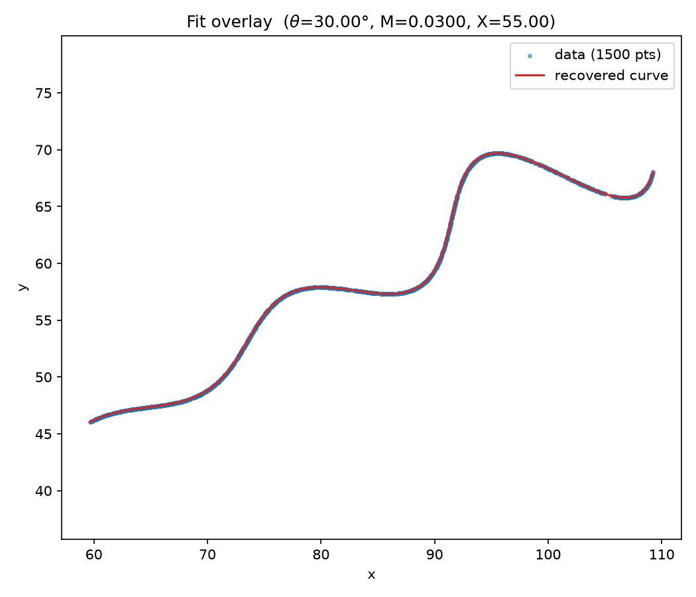
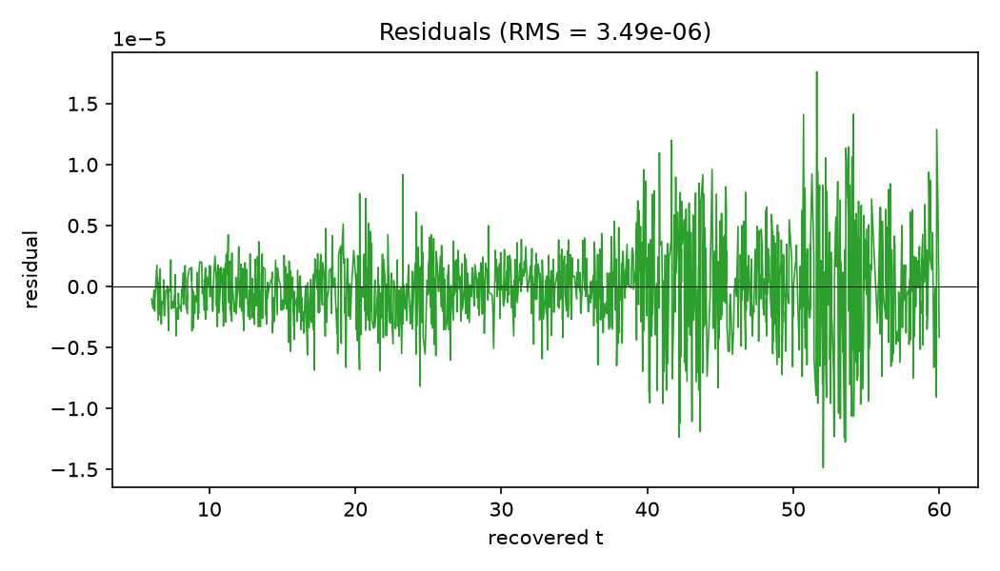
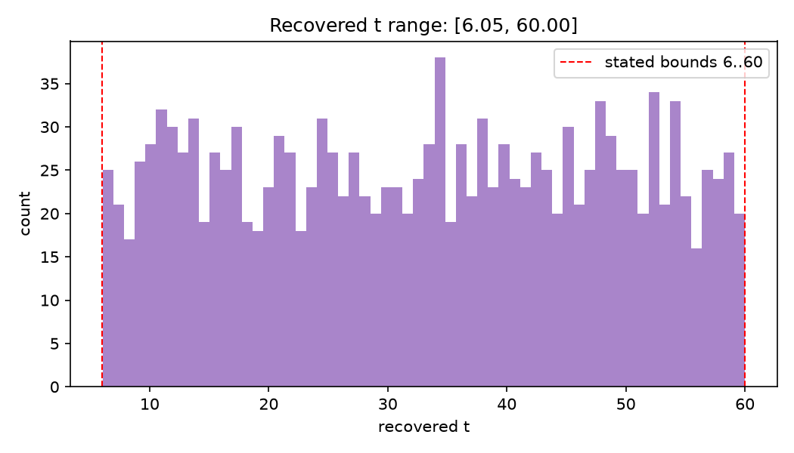
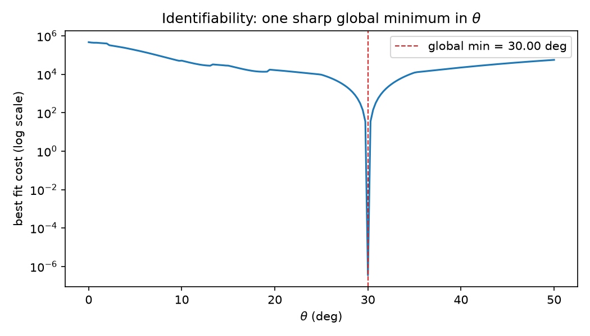
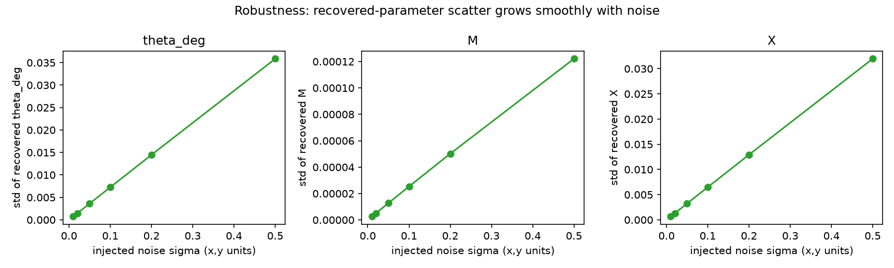

# Parametric Curve Fitting — Recovering θ, M, X

> Flam AI / R&D Assignment — estimating the unknown parameters of a rotated,
> exponentially-modulated spiral from a cloud of `(x, y)` points.

## Problem

Given a list of points that lie on the curve below (for `6 < t < 60`), recover
the three unknown parameters **θ, M, X**.

```
x = t·cos(θ) − e^(M·|t|)·sin(0.3t)·sin(θ) + X
y = 42 + t·sin(θ) + e^(M·|t|)·sin(0.3t)·cos(θ)
```

**Search ranges**

| Param | Range |
|-------|-------|
| θ | 0° < θ < 50° |
| M | −0.05 < M < 0.05 |
| X | 0 < X < 100 |
| t | 6 < t < 60 |

## Results

Running the fit on the provided 1500-point dataset recovers clean, round
parameters:

| Parameter | Recovered value |
|-----------|-----------------|
| θ | 30.0000° (0.523599 rad) |
| M | 0.030000 |
| X | 55.0000 |

with an **RMS residual of ~3.5 × 10⁻⁶** and a recovered `t`-range of
`[6.05, 60.00]` — cleanly inside the stated `6 < t < 60`. Because that range was
never used during fitting, it is independent evidence that this is the true
solution and not a spurious local minimum.

**Fit overlay** — the recovered curve drawn on top of the data points:



**Residuals** — per-point error vs recovered `t`, on the order of 10⁻⁶ (the mild
growth with `t` is expected: the `e^(M·t)` factor amplifies the signal at large `t`):



**Recovered `t`** — every recovered `t` lands inside the stated `[6, 60]` window:



See [docs/derivation.md](docs/derivation.md) for the full method.

### How trustworthy is it?

A point estimate isn't a finished answer — `src/analysis.py` also reports how
precise, how unique, and how robust it is (`python -m src.analysis`).

**Precision.** 1σ error bars from the fit's Jacobian covariance are ~10⁻⁶ on this
essentially-exact data — the parameters are pinned to the data's own precision.

**Uniqueness.** Scanning θ across its whole range gives a single sharp global
minimum at 30°, so the answer is the true global optimum, not a local trap:



**Robustness.** Injecting `(x, y)` noise and refitting shows the recovered
parameters scatter linearly with the noise and without bias — the method is not
overfit to this one clean dataset:



## Repository layout

```
data/            input points (xy_data.csv)
src/             model, fitting, and validation code
docs/            mathematical derivation
assets/          plots (fit overlay, residuals, recovered-t)
tests/           sanity tests
main.py          CLI entry point
```

## Setup

```bash
python -m venv .venv
source .venv/Scripts/activate   # Windows (Git Bash);  use .venv/bin/activate on macOS/Linux
pip install -r requirements.txt
```

## Usage

Recover the parameters from the provided data:

```bash
python main.py
```

```
Recovered parameters
  theta = 30.0000 deg  (0.523599 rad)
  M     = 0.030000
  X     = 55.0000
Fit quality
  RMS residual = 3.490e-06
  recovered t  = [6.05, 60.00]  (stated: 6 < t < 60)
```

Regenerate the plots in `assets/` as well:

```bash
python main.py --plots
```

Or run the fit on a different point cloud:

```bash
python main.py --data path/to/points.csv
```
